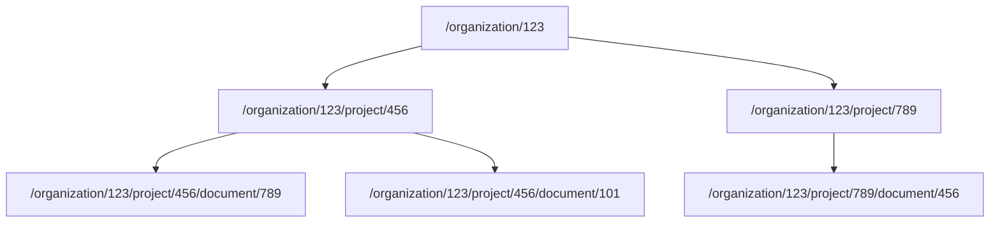
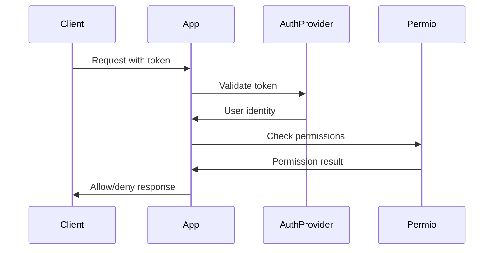

# How It Works

Permio implements **Resource-Specific Role-Based Access Control (RBAC)**, a modern approach to access management that provides fine-grained control over who can access what resources in your application.

## Core Concepts

### 1. Resources and Resource URIs

**Resources** are the core building blocks of Permio's permission system. A resource represents any object, entity, or endpoint in your application that you want to protect.

Resources are identified by **Resource URIs** - hierarchical path strings that uniquely identify each resource:

```
/organisation/123
/organisation/123/project/456
/organisation/123/project/456/document/789
/user/1234
/user/1234/profile
/tenant/abc/workspace/def/file/ghi
```

#### URI Structure Best Practices

- **Start with a slash**: All URIs begin with `/`
- **Use logical hierarchy**: Organize resources in a tree-like structure
- **Include identifiers**: Use specific IDs to identify individual resources
- **Keep it readable**: Use descriptive names that reflect your application structure

=== "Good Examples"
    ```
    /project/456/documents/789
    /user/1234/settings/notifications
    /tenant/abc/billing/invoices/invoice-2024-001
    ```

=== "Avoid"
    ```
    project-456-document-789
    /users/1234-settings-notifications
    /random/deep/nesting/without/purpose
    ```

### 2. Principals

**Principals** are entities that can be granted permissions. In most cases, these are users, but they can also represent:

- **Users**: Individual people with accounts
- **Service accounts**: Applications or automated systems
- **API keys**: Programmatic access tokens
- **External systems**: Third-party integrations

Principals are identified by unique strings (usually user IDs or API key identifiers).

### 3. Permissions

**Permissions** define specific actions that can be performed. They represent the atomic level of access control:

```json
{
  "name": "document.read",
  "description": "Allows reading documents"
}
```

#### Permission Naming Convention

Use dot notation for hierarchical permission names:

- `document.read` - Read documents
- `document.write` - Create/update documents  
- `document.delete` - Delete documents
- `user.profile.update` - Update user profiles
- `billing.invoice.create` - Create billing invoices

### 4. Roles

**Roles** are collections of permissions that can be assigned as a group. They simplify permission management by grouping related permissions together:

```json
{
  "name": "document_editor",
  "description": "Can read and write documents",
  "permissions": ["document.read", "document.write"]
}
```

Common role patterns:
- **Viewer roles**: Read-only access (`*.read` permissions)
- **Editor roles**: Read and write access
- **Admin roles**: Full access including delete permissions
- **Custom roles**: Specific combinations for your use case

## Hierarchical Permission Inheritance

One of Permio's most powerful features is **hierarchical inheritance**. Permissions granted on parent resources automatically apply to all child resources.

### How Inheritance Works



If a user has `document.read` permission on `/organization/123`, they automatically have read access to:
- All projects in the organization
- All documents in those projects
- Any future resources created under this organization

### Inheritance Examples

#### Example 1: Organization-wide Access
```json
{
  "principal": "admin-user-123",
  "resource_uri": "/organization/abc",
  "permissions": ["organization.admin"]
}
```
**Result**: Admin can manage the entire organization and all its contents.

#### Example 2: Project-specific Access
```json
{
  "principal": "project-manager-456",
  "resource_uri": "/organization/abc/project/web-app",
  "permissions": ["project.manage"]
}
```
**Result**: Manager can handle all aspects of the web-app project, but not other projects.

#### Example 3: Document-specific Access
```json
{
  "principal": "editor-789",
  "resource_uri": "/organization/abc/project/web-app/document/readme",
  "permissions": ["document.edit"]
}
```
**Result**: Editor can only modify this specific document.

### Permission Resolution Process

When checking permissions, Permio follows this resolution process:

1. **Direct Match**: Check for permissions directly assigned to the specific resource
2. **Parent Traversal**: Walk up the URI hierarchy checking each parent level
3. **Role Expansion**: Expand roles into their constituent permissions
4. **Inheritance Application**: Apply inherited permissions from parent resources
5. **Final Decision**: Grant access if any permission grants are found

## Authentication vs Authorization

Permio focuses purely on **authorization** (what can you do?) and is completely **authentication-agnostic** (who are you?).

### Authentication (External)
- **Identity verification**: Login, passwords, MFA
- **Token issuance**: JWTs, session cookies, API keys
- **Identity providers**: Auth0, Firebase Auth, custom systems

### Authorization (Permio)
- **Permission checking**: Can user X perform action Y on resource Z?
- **Access control**: Role and permission management
- **Policy enforcement**: Hierarchical permission inheritance

### Integration Flow



1. **Client** sends request with authentication token
2. **Your application** validates the token with your auth provider
3. **Auth provider** confirms identity and returns user info
4. **Your application** calls Permio to check permissions
5. **Permio** returns permission check result
6. **Your application** allows or denies the request

## API-First Architecture

Permio is built with an **API-first** philosophy, offering multiple access methods:

### REST API
Standard HTTP endpoints for web applications:
```bash
curl -X POST "https://api.perms.io/permissions-service/v1/permissions/check" \
  -H "Authorization: Bearer YOUR_API_KEY" \
  -d '{"principal_id": "user_123", "resource_uris": ["/documents/doc_456"], "permissions": ["document.read"]}'
```

### gRPC API
High-performance binary protocol for backend services:
```go
resp, err := client.Check(ctx, &permissionsv1.CheckPermissionRequest{
    PrincipalId:  "user_123",
    ResourceUris: []string{"/documents/doc_456"},
    Permissions:  []string{"document.read"},
})
```

### Dashboard UI
Web interface for visual management:
- Create and manage permissions and roles
- View permission assignments
- Monitor usage and analytics
- Manage organizations and projects

## Performance and Scalability

### Optimized for Speed
- **Sub-millisecond latency**: Cached permission checks
- **High throughput**: Thousands of checks per second
- **Efficient algorithms**: Optimized permission resolution
- **Smart caching**: Automatic result caching

### Scaling Strategies
- **Batch operations**: Check multiple permissions at once
- **Client-side caching**: Cache results in your application
- **Regional deployment**: Global edge locations
- **Horizontal scaling**: Auto-scaling infrastructure

### Performance Best Practices

#### 1. Batch Permission Checks
```json
{
  "principal_id": "user_123",
  "resource_uris": ["/doc/1", "/doc/2", "/doc/3"],
  "permissions": ["read", "write"]
}
```

#### 2. Use Specific Resource URIs
```bash
# Good: Specific resource
/project/456/document/789

# Avoid: Overly broad checks
/project/456/*
```

#### 3. Design Efficient Hierarchies
```bash
# Good: Logical hierarchy
/tenant/abc/workspace/def/project/ghi

# Avoid: Flat structure requiring many checks
/resource-tenant-abc-workspace-def-project-ghi
```

## Common Implementation Patterns

### 1. Multi-tenant Applications

Isolate tenants using hierarchical resource URIs:

```bash
# Tenant A resources
/tenant/company-a/projects/web-app
/tenant/company-a/users/user-123

# Tenant B resources  
/tenant/company-b/projects/mobile-app
/tenant/company-b/users/user-456
```

Grant access at the tenant level:
```json
{
  "principal": "admin@company-a.com",
  "resource_uri": "/tenant/company-a",
  "roles": ["tenant_admin"]
}
```

### 2. Document Management System

```bash
# Workspace hierarchy
/workspace/engineering/folders/backend
/workspace/engineering/folders/backend/documents/api-spec.md
/workspace/marketing/folders/campaigns
/workspace/marketing/folders/campaigns/documents/q4-plan.pdf
```

Role assignments:
```json
[
  {
    "principal": "john@company.com",
    "resource_uri": "/workspace/engineering",
    "roles": ["workspace_admin"]
  },
  {
    "principal": "jane@company.com", 
    "resource_uri": "/workspace/engineering/folders/backend",
    "roles": ["folder_editor"]
  }
]
```

### 3. Project-based Access Control

```bash
# Project structure
/organization/acme/project/web-app
/organization/acme/project/web-app/environments/production
/organization/acme/project/web-app/environments/staging
/organization/acme/project/mobile-app
```

Team permissions:
```json
[
  {
    "principal": "dev-team",
    "resource_uri": "/organization/acme/project/web-app/environments/staging", 
    "permissions": ["deploy", "debug", "monitor"]
  },
  {
    "principal": "ops-team",
    "resource_uri": "/organization/acme/project/web-app/environments/production",
    "permissions": ["deploy", "monitor"] 
  }
]
```

## Security Considerations

### Principle of Least Privilege
- Grant minimal permissions required for each role
- Regularly audit and review permission assignments
- Use time-limited permissions where appropriate
- Implement permission approval workflows for sensitive resources

### Resource URI Validation
Always validate resource URIs in your application:

```go
func validateResourceURI(uri string) error {
    if !strings.HasPrefix(uri, "/") {
        return errors.New("resource URI must start with /")
    }
    
    if strings.Contains(uri, "..") {
        return errors.New("resource URI cannot contain path traversal")
    }
    
    // Add more validation as needed
    return nil
}
```

### Permission Boundary Enforcement
Implement checks at multiple levels:

```go
// 1. Application level - before business logic
if !hasPermission(userID, resourceURI, "document.read") {
    return errors.New("access denied")
}

// 2. API gateway level - before reaching your service
// 3. Database level - row-level security policies
```

## Integration Examples

### Express.js Middleware

```javascript
function requirePermission(resource, permission) {
  return async (req, res, next) => {
    const userId = req.user.id;
    
    const hasAccess = await permio.check({
      principal_id: userId,
      resource_uris: [resource],
      permissions: [permission]
    });
    
    if (hasAccess.passed) {
      next();
    } else {
      res.status(403).json({ error: 'Access denied' });
    }
  };
}

// Usage
app.get('/documents/:id', 
  requirePermission('/documents/' + req.params.id, 'document.read'),
  getDocument
);
```

### Django Decorator

```python
def require_permission(resource_template, permission):
    def decorator(view_func):
        def wrapper(request, *args, **kwargs):
            user_id = request.user.id
            resource_uri = resource_template.format(**kwargs)
            
            result = permio_client.check(
                principal_id=user_id,
                resource_uris=[resource_uri],
                permissions=[permission]
            )
            
            if not result.passed:
                return HttpResponseForbidden("Access denied")
                
            return view_func(request, *args, **kwargs)
        return wrapper
    return decorator

# Usage
@require_permission('/documents/{document_id}', 'document.read')
def get_document(request, document_id):
    # View logic here
    pass
```

### Go Service

```go
type PermissionChecker struct {
    client permissionsv1.PermissionsServiceClient
}

func (p *PermissionChecker) CheckAccess(ctx context.Context, userID, resourceURI, permission string) error {
    resp, err := p.client.Check(ctx, &permissionsv1.CheckPermissionRequest{
        PrincipalId:  userID,
        ResourceUris: []string{resourceURI},
        Permissions:  []string{permission},
    })
    
    if err != nil {
        return fmt.Errorf("permission check failed: %w", err)
    }
    
    if !resp.Passed {
        return fmt.Errorf("access denied to %s on %s", permission, resourceURI)
    }
    
    return nil
}

// Usage in handlers
func (h *DocumentHandler) GetDocument(w http.ResponseWriter, r *http.Request) {
    userID := getUserFromContext(r.Context())
    documentID := mux.Vars(r)["id"]
    resourceURI := fmt.Sprintf("/documents/%s", documentID)
    
    if err := h.permChecker.CheckAccess(r.Context(), userID, resourceURI, "document.read"); err != nil {
        http.Error(w, "Access denied", http.StatusForbidden)
        return
    }
    
    // Proceed with document retrieval
}
```

## Getting Started

1. **Create Account**: Sign up at [app.perms.io](https://app.perms.io)
2. **Setup Organization**: Create your organization and first project
3. **Generate API Key**: Create an API key for your application
4. **Define Permissions**: Create permissions that match your application's actions
5. **Create Roles**: Group permissions into meaningful roles
6. **Assign Permissions**: Grant roles and permissions to users on resources
7. **Integrate**: Add permission checks to your application
8. **Test**: Verify that access control works as expected

Ready to implement fine-grained access control? Check out our [Quick Start Guide](./quickstart.md) to get up and running in minutes!