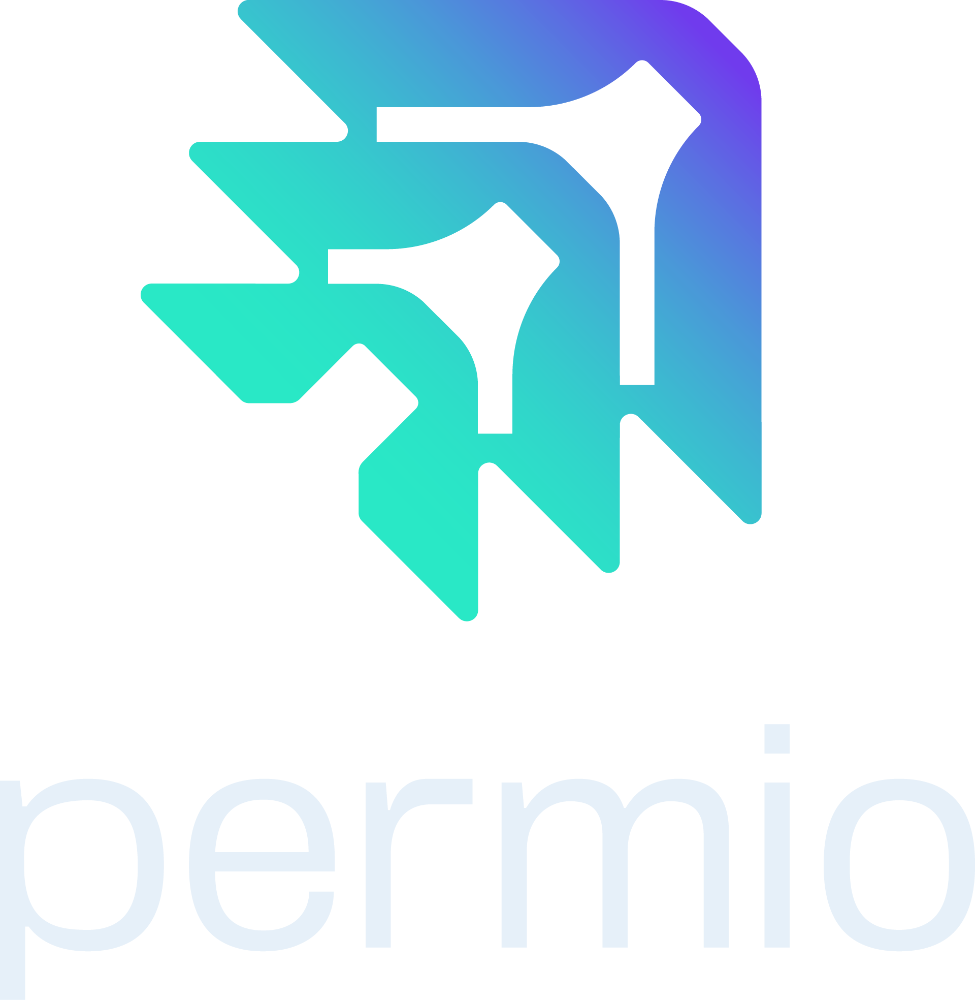

    

Permio is a **Resource-Specific Role-Based Access Control (RBAC)** system designed for modern applications that require **fine-grained, high-performance, and scalable permission management**. With an **API-First approach**, **authentication-agnostic design**, and a built-in **UI Dashboard**, Permio empowers developers and admins to define and enforce permissions at the most granular level.

Manage your organization visually via the dashboard at [app.perms.io](https://app.perms.io) or programmatically via the API.

---

## 🔧 Key Features

### ✅ Resource-Level RBAC
Permio enables access control at the *individual object level*. You can define access rules for *specific instances* of data (e.g., /project/42, /user/1234), enabling secure and flexible permissioning for complex apps.

### 🏗️ Hierarchical Inheritance
Define roles and permissions at higher levels (e.g., /user) and let them *automatically propagate* to nested resources (e.g., /user/1234, /user/1234/documents/5678).

## Commands

* `mkdocs new [dir-name]` - Create a new project.
* `mkdocs serve` - Start the live-reloading docs server.
* `mkdocs build` - Build the documentation site.
* `mkdocs -h` - Print help message and exit.

## Project layout

    mkdocs.yml    # The configuration file.
    docs/
        index.md  # The documentation homepage.
        ...       # Other markdown pages, images and other files.
